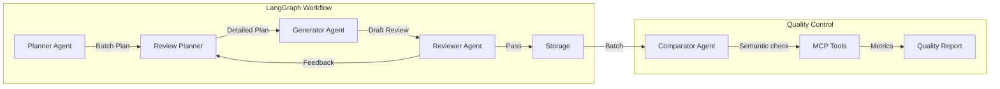

# Agentic Synthetic Data Generator

A powerful, robust tool for generating high-quality synthetic product reviews using agentic workflows (**LangGraph**), **MCP tools**, and advanced quality metrics. Designed for dataset creation, benchmarking, and augmentation.

## 🚀 Key Features

*   **Multi-Agent Architecture**: 
    *   **Planner**: Strategies personas and ratings.
    *   **Generator**: Writes reviews based on detailed plans.
    *   **Reviewer**: Quality gates every review (scoring, logic checks).
    *   **Comparator**: Semantic deduplication and real-dataset comparison.
*   **Multi-Provider Support**: Seamlessly switch between **Google (Gemini)**, **Groq (Llama 3)**, and **Ollama (Mistral/Local)**.
*   **Robust & Resilient**: Handles API rate limits with smart exponential backoff (crucial for Groq/Free tiers).
*   **Automated Insights**: Auto-generates detailed JSON & Markdown quality reports with diversity, bias, and realism metrics.
*   **Isolated Outputs**: Data is saved in model-specific files to prevent contamination (e.g., `generated_reviews_google_gemini.jsonl`).

---

## 🛠️ Setup & Configuration

### 1. Prerequisites
*   Python 3.10+
*   Virtual Environment (recommended)

### 2. Installation

```bash
# Create and activate venv
python3 -m venv venv
source venv/bin/activate

# Install dependencies
pip install -r requirements.txt

# Download Spacy model (for NLP metrics)
python -m spacy download en_core_web_sm
```

### 3. Environment Configuration (`.env`)
Create a `.env` file in the root directory. Configure your desired provider:

**Option A: Groq (Llama 3 - Recommended for speed)**
```bash
LLM_PROVIDER1=groq
GROQ_API_KEY=gsk_...
GROQ_MODEL=llama-3.3-70b-versatile
```

**Option B: Google (Gemini)**
```bash
LLM_PROVIDER1=google
GOOGLE_PROJECT_ID=your-project-id
GOOGLE_LOCATION=us-central1
MODEL_NAME=gemini-2.0-flash-001
```

**Option C: Ollama (Local)**
```bash
LLM_PROVIDER1=ollama
OLLAMA_MODEL=mistral
OLLAMA_HOST=http://localhost:11434
```

---

## 💻 CLI Usage

The project offers a clean CLI to manage the entire workflow.

### 1. Generate Reviews
Generates synthetic data. Automatically handles file naming and quality reporting.

```bash
# Generate 50 reviews (uses settings from .env)
python cli.py generate --count 50

# Generate 500 reviews
python cli.py generate --count 500
```

**What happens?**
1.  **Plan**: Agents define 500 unique user personas and rating targets.
2.  **Generate**: Content is created and rigorously reviewed (3 retries allowed per review).
3.  **Save**: Data is saved to `data/generated_reviews_<provider>_<model>.jsonl`.
4.  **Report**: A quality report is auto-generated at `data/quality_report_<provider>_<model>.json`.

### 2. Compare Models
After running generation with different models/providers, use this to create a benchmark table.

```bash
python cli.py compare
```

**Output**:
*   Console summary table.
*   `data/model_comparison.json`: Raw comparison data.
*   `data/model_comparison.md`: Markdown report suitable for GitHub/Documentation.

### 3. Migrate Data (Utility)
If you have existing reviews without embeddings, this utility generates them.

```bash
python cli.py migrate
```

---

## 📂 Output Structure

The system enforces strict separation of outputs to strictly isolate model performance.

```text
data/
├── generated_reviews_google_gemini.jsonl    # Main Data (JSON Lines)
├── review_embeddings_google_gemini.npy      # Numpy Embeddings (for fast dedupe)
├── quality_report_google_gemini.json        # Detailed Quality Metrics
├── generated_reviews_groq_llama.jsonl       # Separate file for Groq run
├── model_comparison.md                      # Comparison Report
└── ...
```

---

## 🏗️ Architecture



### Agent Roles

| Agent | Responsibilities |
| :--- | :--- |
| **Planner** | Strategic distribution of ratings (e.g., 60% positive, 20% negative) and persona creation (e.g., "Angry Commuter", "Audiophile"). |
| **Generator** | Creative writing engine. Follows strict constraints (length, style, specific product aspects). |
| **Reviewer** | The "Gatekeeper". Evaluates consistency, tone, and logic. Rejects poor outputs and provides feedback for retry. |
| **Comparator** | Post-generation analysis. Checks diversity, detecting and removing "near-duplicate" reviews using embeddings. |

---

## 📊 Quality Metrics Explained

The system evaluates synthetic data on three key dimensions:

1.  **Diversity**: 
    *   *Semantic Similarity*: Are the reviews saying different things? (Lower similarity is better).
    *   *Lexical Diversity*: Uses Type-Token Ratio (TTR) to ensure varied vocabulary.
2.  **Bias**:
    *   *Rating Distribution*: Does it match the planned distribution?
    *   *Sentiment Consistency*: Do 1-star reviews actually sound negative?
3.  **Realism**:
    *   *Readability*: Flesch Reading Ease score.
    *   *AI Pattern Detection*: Checks for common AIisms (e.g., "As an AI...", "In conclusion").

---

## ⚖️ Design Decisions & Trade-offs

| Decision | Rationale | Trade-off |
| :--- | :--- | :--- |
| **Separate Embedding Files (`.npy`)** | Performance. Loading 10k vectors from JSON is slow; Numpy memmaps are instant. | File management complexity (handled by `ReviewStorage`). |
| **Strict Model Separation** | Benchmarking integrity. We never want to accidentally mix Gemini and Llama data. | Generating data requires setting config for each run. |
| **Exponential Backoff** | Stability. Groq has strict rate limits. Crashing 95% through a run is unacceptable. | Generation can pause for minutes if limits are hit (but it *completes*). |

---

## 📧 Contact

**Momen Ashraf Muhammed**  
[momena.muhammed490@gmail.com](mailto:momena.muhammed490@gmail.com)
